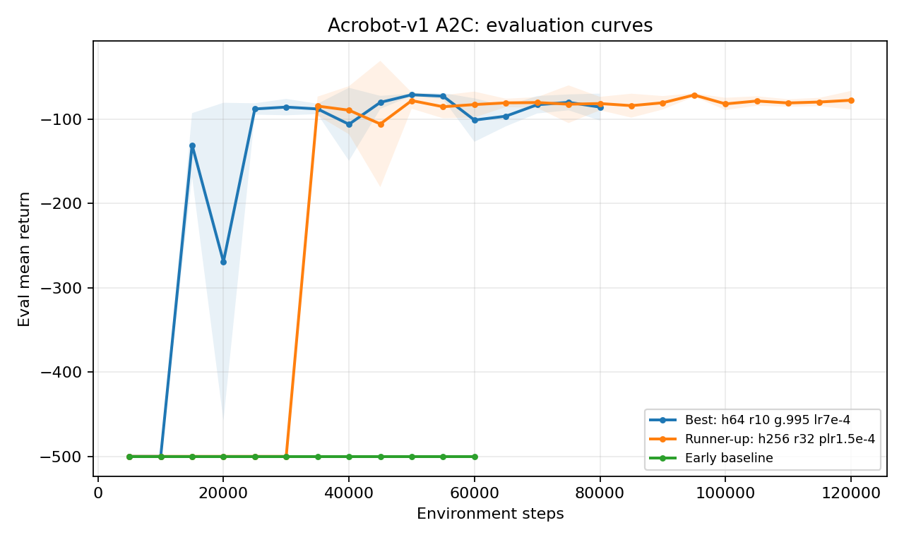
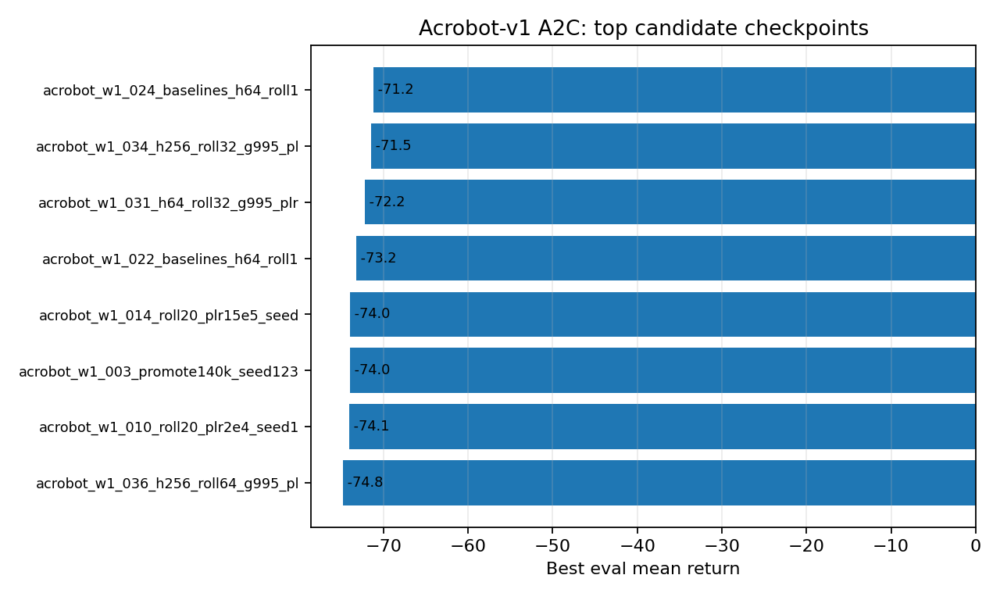

# Acrobot A2C Report

Date: 2026-05-10

## Setup

All runs used `src/train_a2c.py`, CPU execution, and config-only changes. The search started from the CartPole A2C shape, then pivoted to OpenAI Baselines / RL Baselines3 Zoo overlap settings. Source-level features from those references such as vectorized environments, RMSProp, entropy regularization, value-loss weighting, tanh activations, learning-rate schedules, and observation normalization are not exposed by this repo's YAML config.

## Best Config

Saved as `configs/acrobot_a2c.yaml`.

| Parameter | Value |
|---|---:|
| hidden sizes | [64, 64] |
| training steps | 80000 |
| policy learning rate | 0.0007 |
| value learning rate | 0.0007 |
| discount factor | 0.995 |
| rollout steps | 10 |
| max grad norm | 0.5 |
| seed | 123 |

## Result

Best checkpoint: step `50000`, eval mean return `-71.2`, eval std `1.33`, best eval episode `-69.0`.

The best single eval episode seen in the wider sweep was `-62.0`, but it came from a different run with a weaker eval mean. The OpenAI Baselines-derived branch improved the best eval mean from about `-74.0` to `-71.2`.

## Plots

