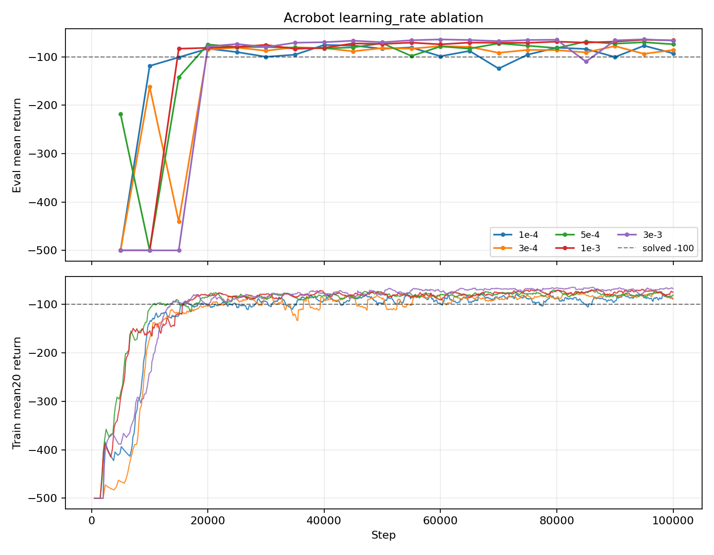
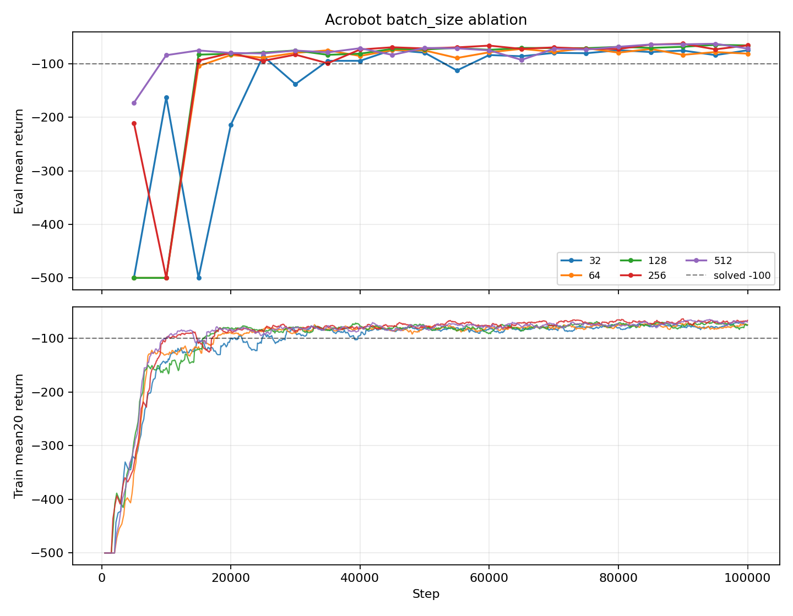
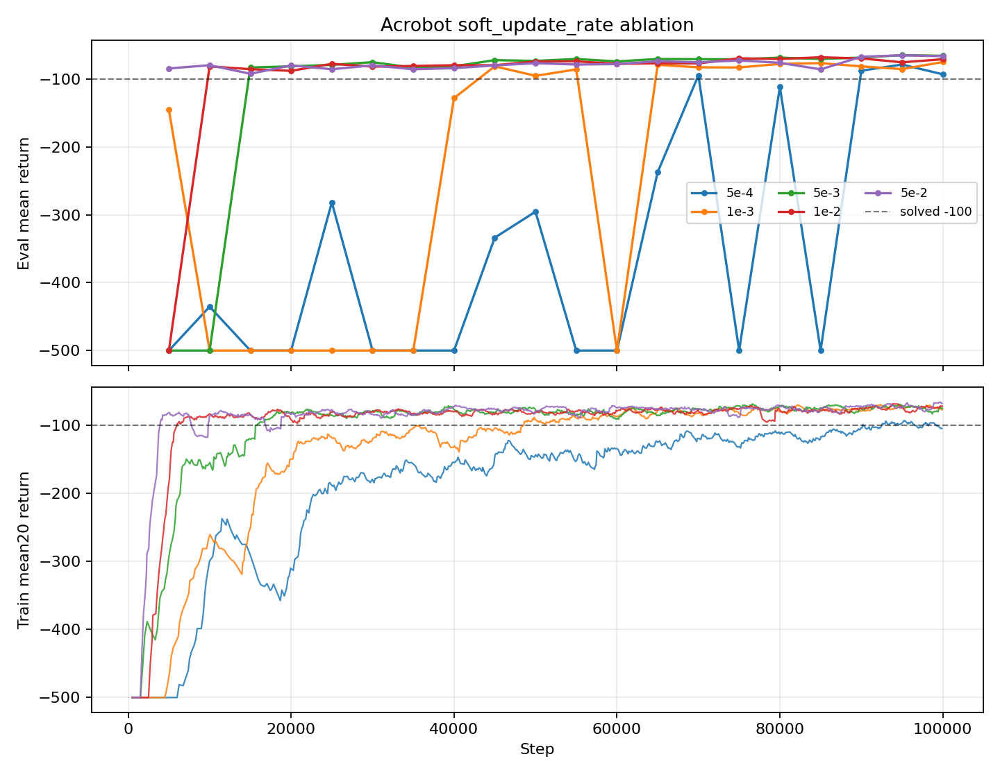
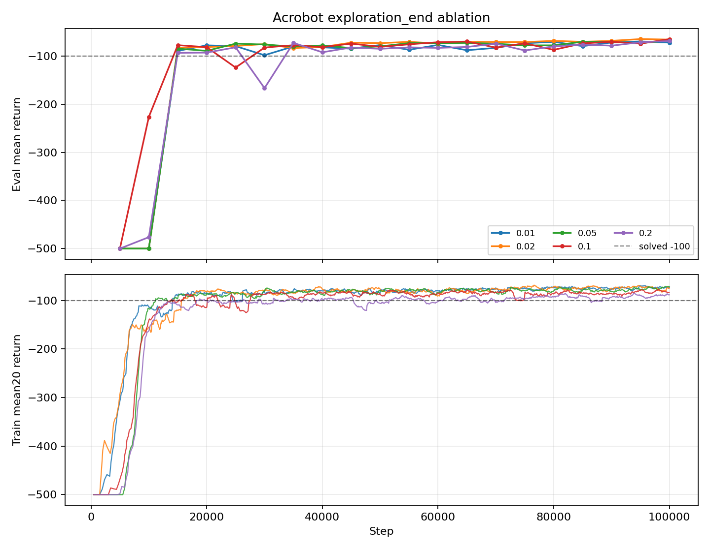
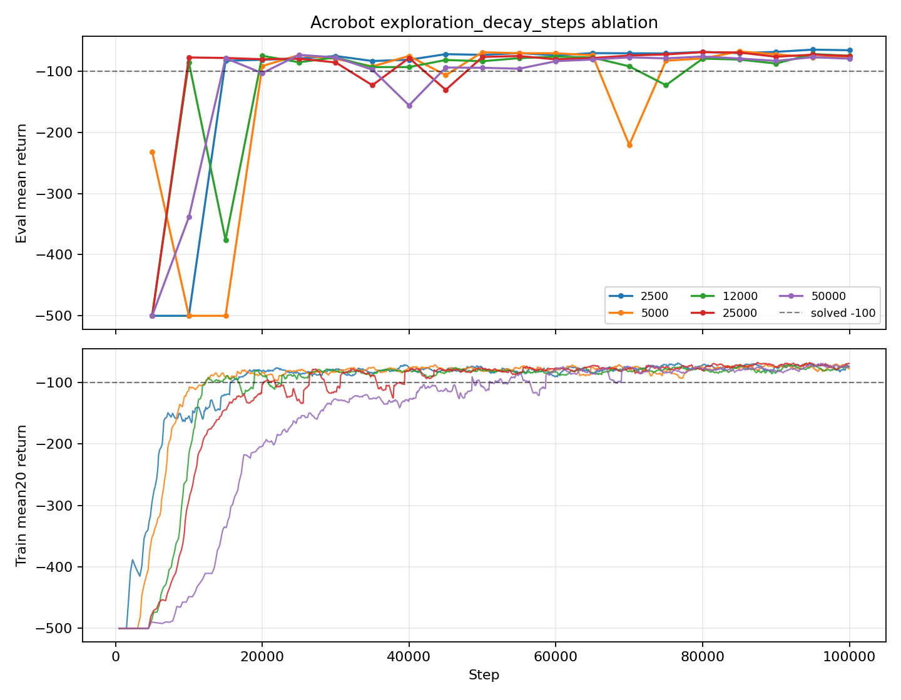

# Acrobot DQN Report

Date: 2026-05-05

Original run ID: `acrobot-grid-ablation-cpu-20260505-171634`

## Setup

This experiment used the updated Acrobot DQN config as the baseline and changed
one hyperparameter at a time. All runs used CPU, seed `123`, `100000`
environment steps, evaluation every `5000` steps, and 10 evaluation episodes.

Baseline config:

| Parameter | Value |
|---|---:|
| hidden sizes | [256, 256] |
| batch size | 128 |
| replay buffer capacity | 50000 |
| learning rate | 0.001 |
| discount factor | 1.0 |
| soft update rate | 0.005 |
| max grad norm | 10 |
| epsilon schedule | linear |
| epsilon start / end | 1.0 / 0.02 |
| epsilon decay steps | 2500 |
| learning starts | 1000 |

## Core Results

| Ablation | Best final setting | Final eval return | Best eval return | Observation |
|---|---:|---:|---:|---|
| baseline | default | -65.9 | -64.9 | updated baseline was already strong |
| learning rate | 0.001 | -65.9 | -64.9 | baseline learning rate gave the best final result; 0.003 peaked at -63.9 |
| batch size | 256 | -65.8 | -62.7 | slightly better than 128, but not a large gap |
| soft update rate | 0.005 | -65.9 | -64.9 | baseline remained best in this sweep |
| epsilon end | 0.1 | -65.0 | -65.0 | best final result, while baseline 0.02 had a slightly better peak |
| epsilon decay steps | 2500 | -65.9 | -64.9 | baseline fast decay remained best |

This is a single-seed screening run, so these results should be treated as
candidates rather than final conclusions. Overall, the updated baseline
`hidden_sizes=[256, 256]`, `batch_size=128`, `learning_rate=0.001`,
`soft_update_rate=0.005`, and `exploration.decay_steps=2500` was already close
to the best region. The only follow-up candidates from this sweep are
`batch_size=256` and `exploration.end=0.1`.

## Ablation Plots

### Learning Rate

### Batch Size

### Soft Update Rate

### Epsilon End

### Epsilon Decay Steps

