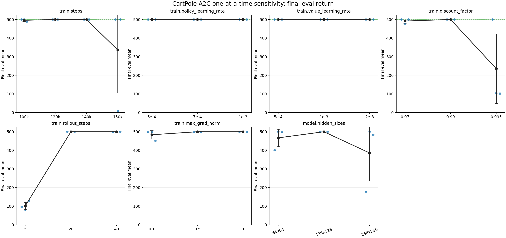
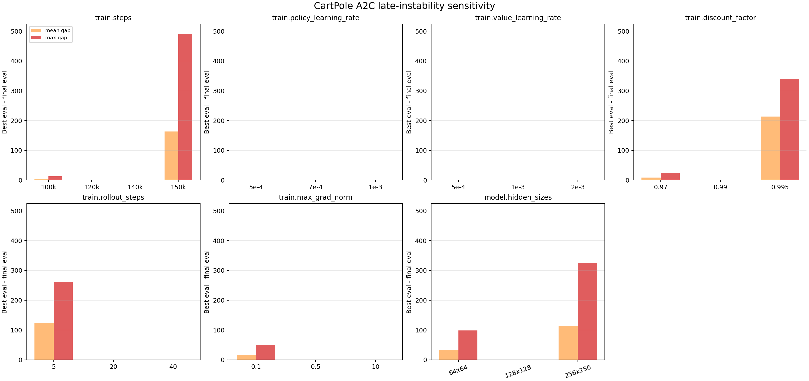
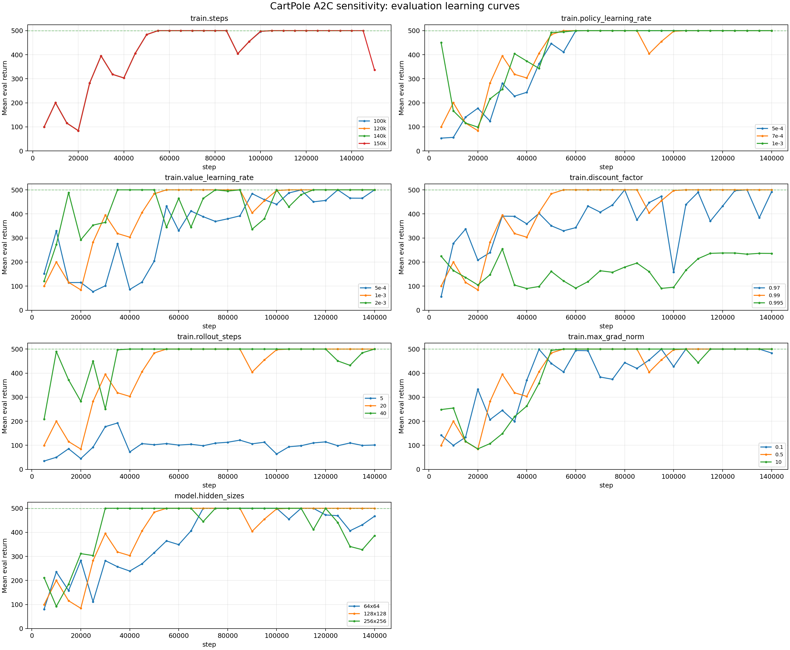

# CartPole A2C Report

Date: 2026-05-07

Run prefixes:

- Final validation: `cartpole_a2c_hp_006_plr7e-4_vlr1e-3_roll20_clip0p5_steps140k_seed*`
- Sensitivity sweep: `cartpole_a2c_sensitivity_*`

## Setup

This experiment updated `configs/cartpole_a2c.yaml` to the strongest validated
CartPole A2C baseline, then changed one hyperparameter at a time to measure
sensitivity. All runs used CPU, evaluation every `5000` steps, and 10
evaluation episodes.

The final baseline was validated on five seeds: `123`, `456`, `789`, `2024`,
and `9001`. The sensitivity sweep used three seeds per setting: `123`, `456`,
and `9001`.

Baseline config:

| Parameter | Value |
|---|---:|
| hidden sizes | [128, 128] |
| train steps | 140000 |
| policy learning rate | 0.0007 |
| value learning rate | 0.001 |
| discount factor | 0.99 |
| rollout steps | 20 |
| max grad norm | 0.5 |

## Final Validation

The updated baseline reached the CartPole-v1 maximum final return on all five
validation seeds.

| Seed | Final step | Final eval return | Final eval std | Best eval return |
|---:|---:|---:|---:|---:|
| 123 | 140000 | 500.0 | 0.0 | 500.0 |
| 456 | 140000 | 500.0 | 0.0 | 500.0 |
| 789 | 140000 | 500.0 | 0.0 | 500.0 |
| 2024 | 140000 | 500.0 | 0.0 | 500.0 |
| 9001 | 140000 | 500.0 | 0.0 | 500.0 |

## Core Results

| Ablation | Best final setting | Mean final eval return | Solved seeds | Best eval return | Observation |
|---|---:|---:|---:|---:|---|
| baseline validation | updated config | 500.0 | 5/5 | 500.0 | final eval was perfect across all validation seeds |
| train steps | 140000 | 500.0 | 3/3 | 500.0 | 120k also solved 3/3, but 100k missed one seed and 150k had a late collapse |
| policy learning rate | 0.0005 to 0.001 | 500.0 | 3/3 for all tested values | 500.0 | low sensitivity in this local range |
| value learning rate | 0.0005 to 0.002 | 500.0 | 3/3 for all tested values | 500.0 | low sensitivity in this local range |
| discount factor | 0.99 | 500.0 | 3/3 | 500.0 | 0.97 was close; 0.995 was unstable |
| rollout steps | 20 | 500.0 | 3/3 | 500.0 | rollout 40 also solved 3/3, but rollout 5 failed all seeds |
| max grad norm | 0.5 | 500.0 | 3/3 | 500.0 | clip 10 also solved 3/3; clip 0.1 was weaker |
| hidden sizes | [128, 128] | 500.0 | 3/3 | 500.0 | smaller and larger networks were less reliable |

Overall, the updated baseline remains the recommended setting. It is not very
sensitive to moderate learning-rate changes, but it is sensitive to rollout
length, discount factor, model width, very tight gradient clipping, and
over-training past the stable window.

The 150k-step run is the clearest late-instability warning: seed `456` was
perfect through 145k steps, then collapsed to final `eval_mean_return=9.2` at
150k. Keep `train.steps=140000`.

## Ablation Plots

Summary CSVs are available under
`research_notes/cartpole_a2c_assets/`:

- `cartpole_a2c_sensitivity_summary.csv`
- `cartpole_a2c_sensitivity_runs.csv`

### Final Eval Sensitivity

### Late Instability Gap

### Evaluation Curves

