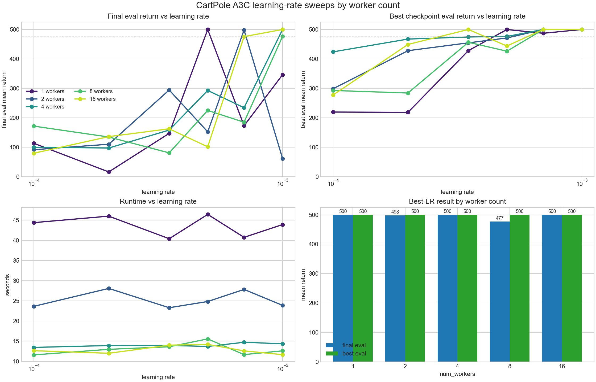
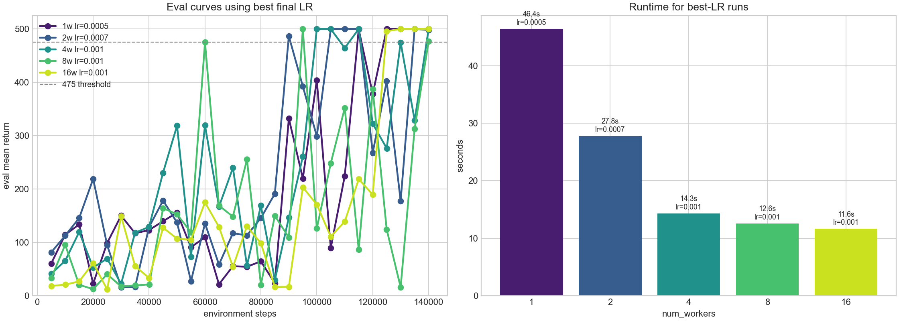
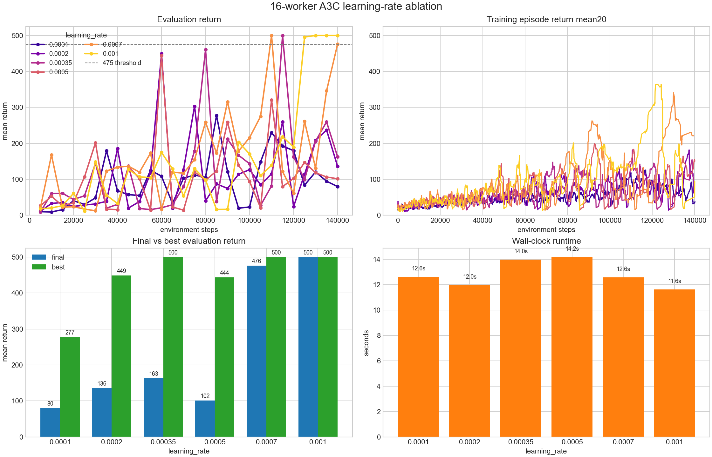
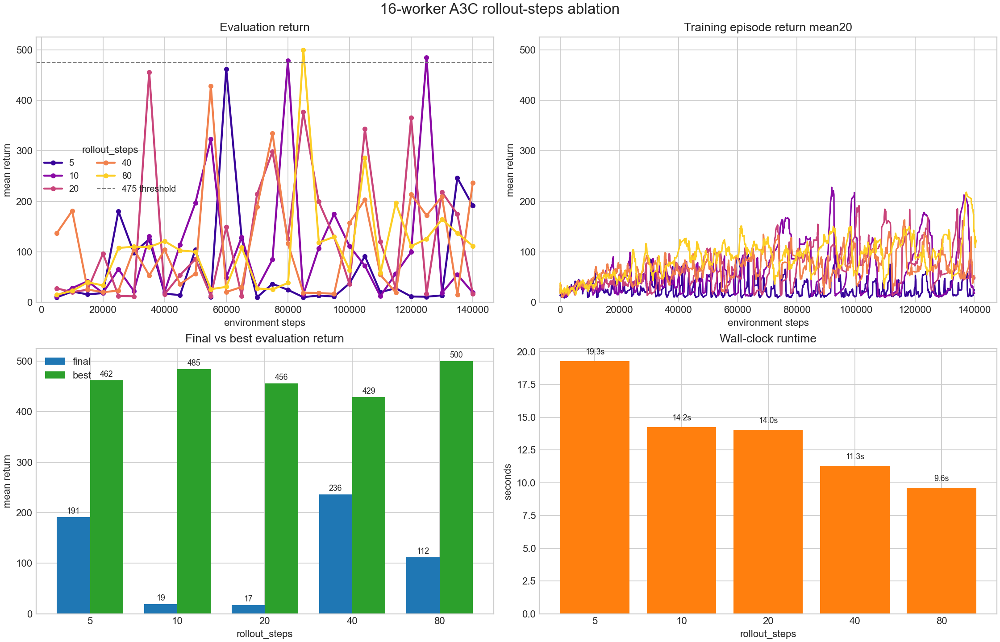
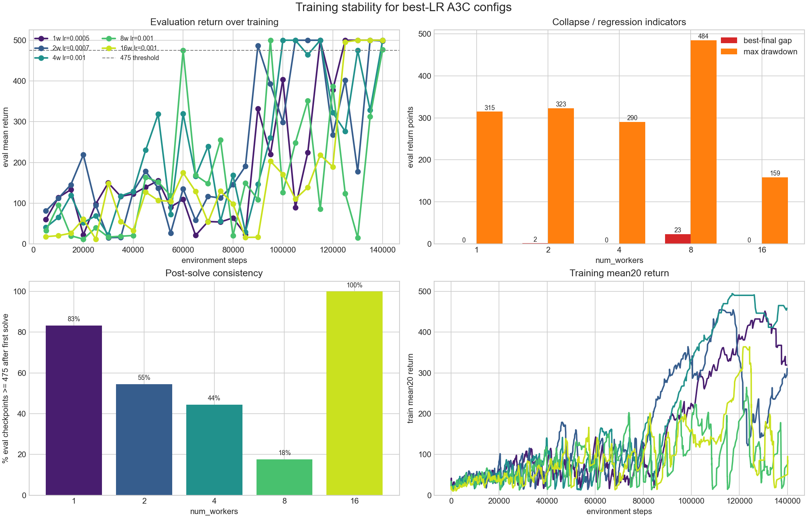
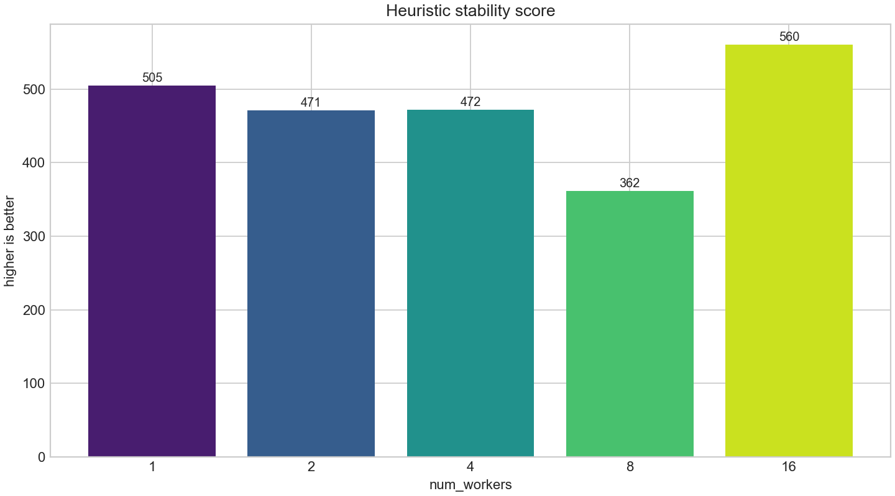

# CartPole A3C worker and learning-rate ablation

This note summarizes the CPU A3C CartPole sweeps run after adding the new
`train_a3c.py` implementation. All runs used `CartPole-v1`, seed `123`,
`140000` total environment steps, evaluation every `5000` steps with 10 eval
episodes, hidden sizes `[128, 128]`, `discount_factor=0.99`,
`rollout_steps=20`, `max_grad_norm=0.5`, `entropy_coef=0.01`, and shared
RMSProp unless noted otherwise.

The main result is that the worker count comparison was strongly coupled to
learning rate. With the inherited A2C-like learning rate `0.0007`, 16 workers
looked poor in one run. After sweeping learning rate per worker count, 16
workers with `learning_rate=0.001` reached a final eval mean return of `500.0`
and was the fastest of the best-LR runs.

## Best learning rate by worker count

Learning rates swept for each worker count were `0.0001`, `0.0002`,
`0.00035`, `0.0005`, `0.0007`, and `0.001`. The selected learning rate is the
one with the strongest final eval mean on this single seed.

| workers | best lr | final eval mean | best eval mean | runtime |
|---:|---:|---:|---:|---:|
| 1 | 0.0005 | 500.0 | 500.0 | 46.4s |
| 2 | 0.0007 | 498.2 | 500.0 | 27.8s |
| 4 | 0.0010 | 500.0 | 500.0 | 14.3s |
| 8 | 0.0010 | 476.8 | 500.0 | 12.6s |
| 16 | 0.0010 | 500.0 | 500.0 | 11.6s |





## 16-worker ablations

For `num_workers=16`, learning rate mattered more than rollout length in these
single-seed runs. With `rollout_steps=20` fixed, `learning_rate=0.001` was the
best final result. Smaller learning rates sometimes reached high intermediate
scores but usually regressed by the final checkpoint.

| learning rate | final eval mean | best eval mean |
|---:|---:|---:|
| 0.0001 | 79.7 | 277.4 |
| 0.0002 | 136.0 | 449.2 |
| 0.00035 | 162.7 | 500.0 |
| 0.0005 | 101.5 | 444.0 |
| 0.0007 | 475.9 | 500.0 |
| 0.0010 | 500.0 | 500.0 |



With `num_workers=16` and `learning_rate=0.0007` fixed, rollout-length results
were unstable. Several settings reached strong intermediate scores but did not
keep them through the final checkpoint.

| rollout steps | final eval mean | best eval mean |
|---:|---:|---:|
| 5 | 191.4 | 462.1 |
| 10 | 19.3 | 484.6 |
| 20 | 17.3 | 455.8 |
| 40 | 236.4 | 428.6 |
| 80 | 111.7 | 500.0 |



## Stability

The best-LR configs all reached or nearly reached solved performance, but their
stability profiles differed.

| workers | lr | final eval | max drawdown | min after solved | post-solve evals >= 475 |
|---:|---:|---:|---:|---:|---:|
| 1 | 0.0005 | 500.0 | 314.7 | 378.1 | 83% |
| 2 | 0.0007 | 498.2 | 322.7 | 177.3 | 55% |
| 4 | 0.0010 | 500.0 | 290.2 | 276.2 | 44% |
| 8 | 0.0010 | 476.8 | 484.5 | 15.5 | 18% |
| 16 | 0.0010 | 500.0 | 158.6 | 495.8 | 100% |





The 8-worker best-LR run was the least stable: it solved early but collapsed
several times. The 16-worker best-LR run solved later, but after crossing the
solved threshold it stayed solved for the remaining eval checkpoints.

## Config update

The default `configs/cartpole_a3c.yaml` was updated to:

```yaml
train:
  steps: 140000
  num_workers: 16
  learning_rate: 0.001
  discount_factor: 0.99
  rollout_steps: 20
  max_grad_norm: 0.5
  entropy_coef: 0.01
  rmsprop_alpha: 0.99
  rmsprop_eps: 0.00001
```

This is a single-seed result. The next step should be a multi-seed check for
the most relevant configs, especially `4w/lr=0.001`, `8w/lr=0.001`, and
`16w/lr=0.001`.
