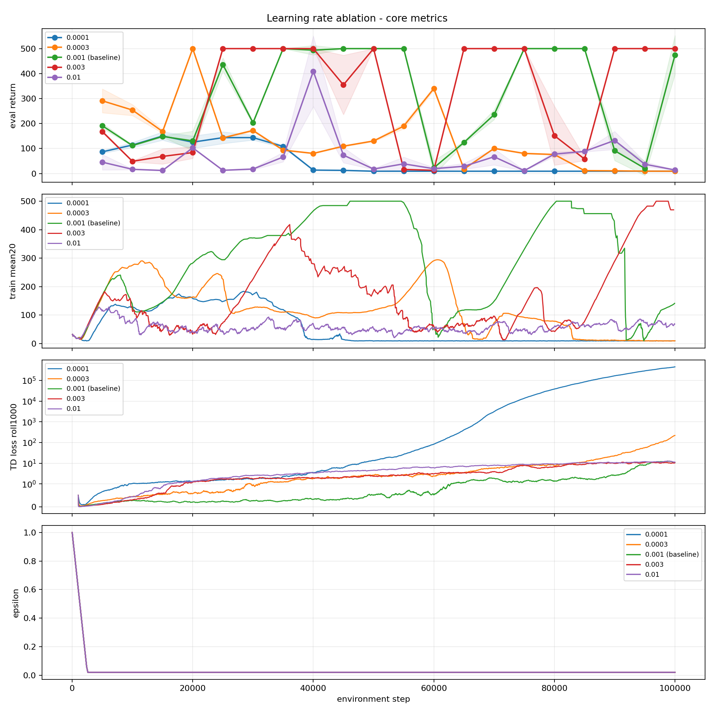
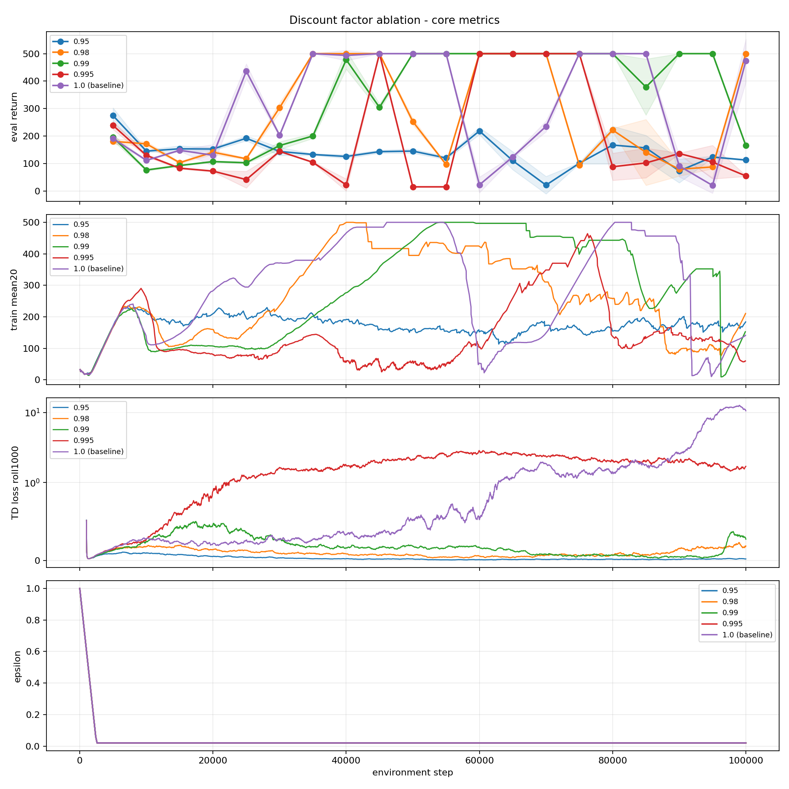
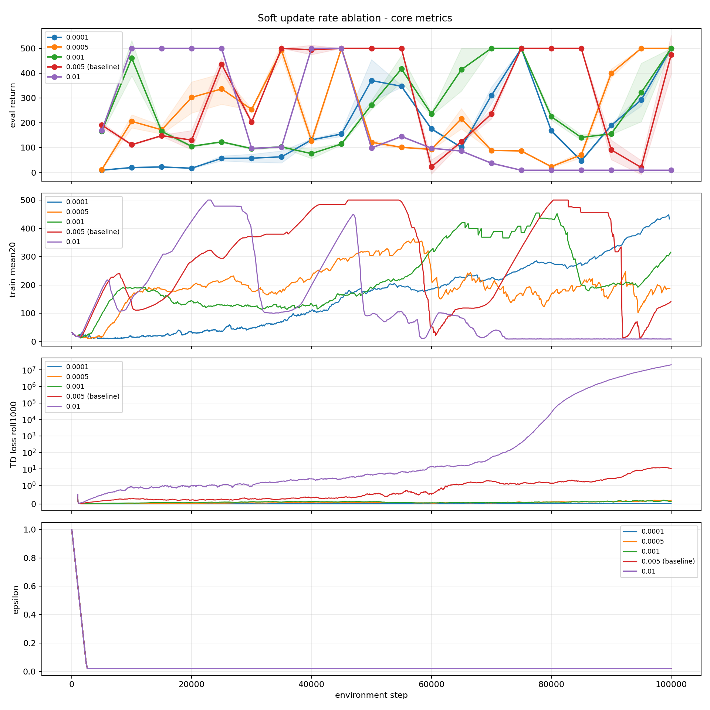
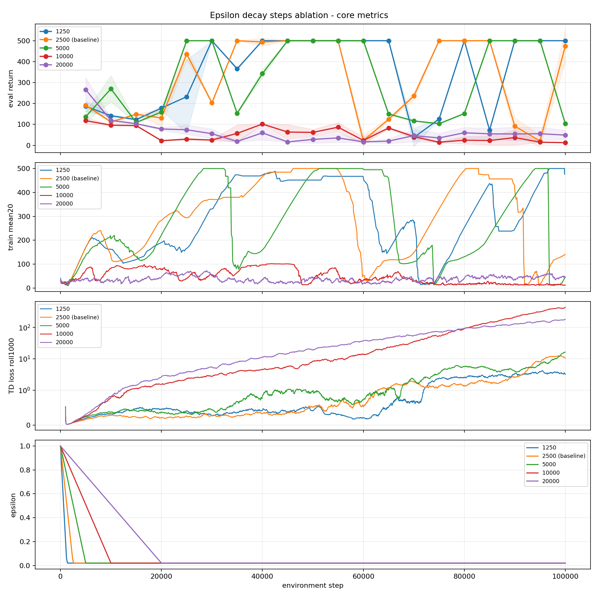
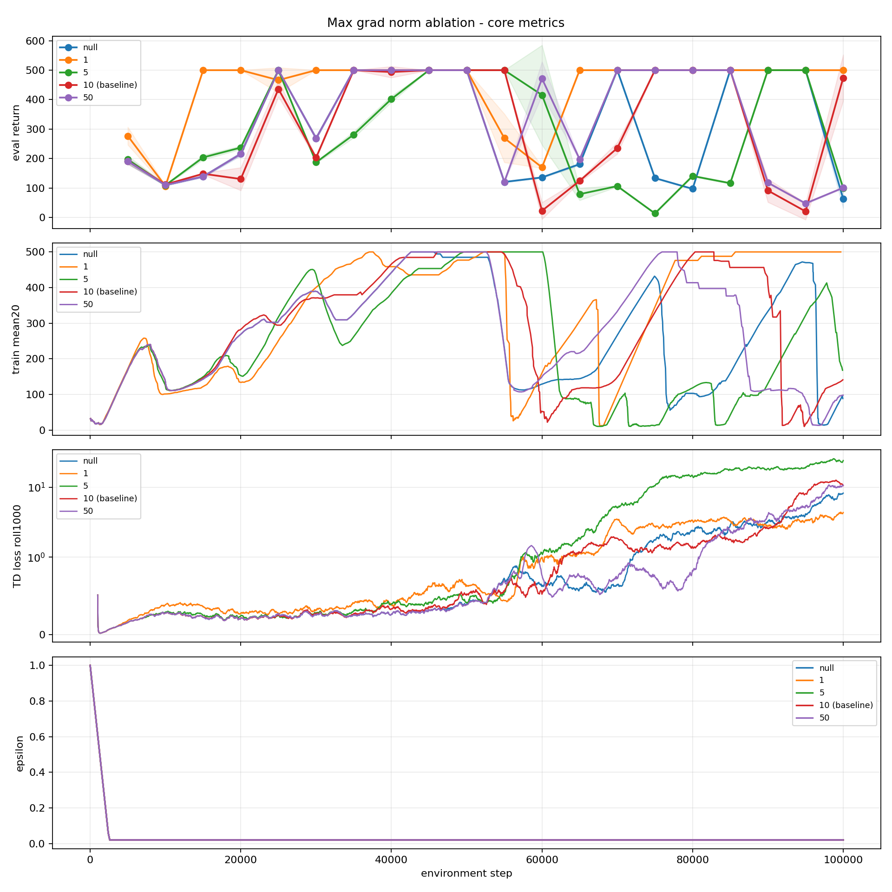

# CartPole DQN 100k One-Factor Ablation

Date: 2026-05-04

Original run ID: `ablate-default-100k-one-factor-20260504-211908`

## Setup

This experiment used the current default CartPole DQN config as the baseline and changed one hyperparameter at a time. All runs used CPU, seed `123`, `100000` environment steps, evaluation every `5000` steps, and 10 evaluation episodes.

Baseline config:

| Parameter | Value |
|---|---:|
| batch size | 32 |
| replay buffer capacity | 50000 |
| learning rate | 0.001 |
| discount factor | 1.0 |
| soft update rate | 0.005 |
| max grad norm | 10 |
| epsilon schedule | linear |
| epsilon start / end | 1.0 / 0.02 |
| epsilon decay steps | 2500 |
| learning starts | 1000 |

## Core Results

| Ablation | Best final setting | Final eval return | Best eval return | Observation |
|---|---:|---:|---:|---|
| baseline | default | 473.9 | 500 | reached 500, then dipped by the end |
| learning rate | 0.003 | 500 | 500 | strongest final result among tested learning rates |
| discount factor | 0.98 | 500 | 500 | more stable than 0.99 and 1.0 in this run |
| soft update rate | 0.0001 | 500 | 500 | strongest final result with the lowest loss scale |
| epsilon decay steps | 1250 | 500 | 500 | faster epsilon decay worked best in this seed |
| max grad norm | 1 | 500 | 500 | most stable final result among clipping settings |

This is a single-seed screening run, so these results should be treated as candidates rather than final conclusions. The strongest candidates for a follow-up multi-seed test are `learning_rate=0.003`, `discount_factor=0.98`, `soft_update_rate=0.0001`, `exploration.decay_steps=1250`, and `max_grad_norm=1`.

## Ablation Plots

### Learning Rate

### Discount Factor

### Soft Update Rate

### Epsilon Decay Steps

### Max Grad Norm

