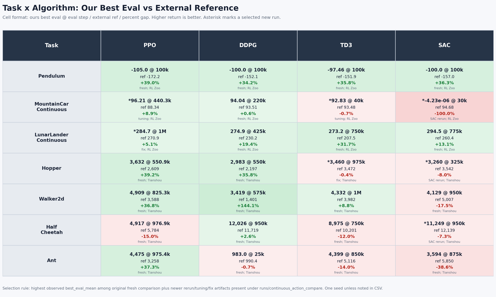
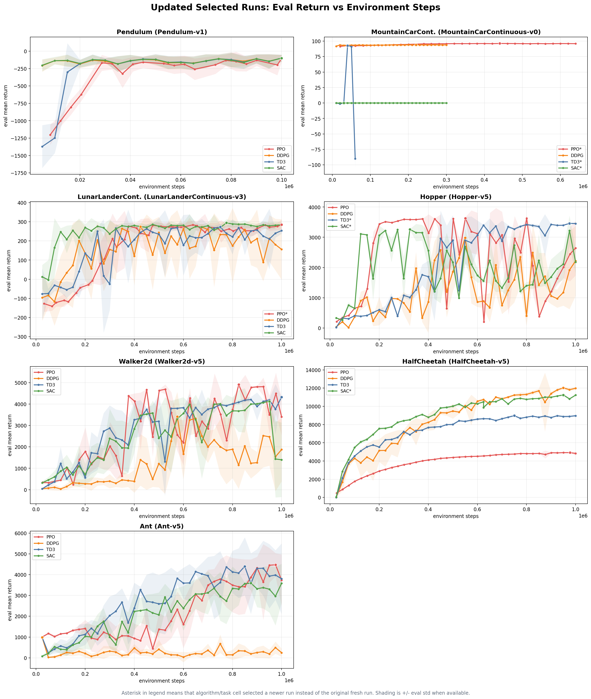
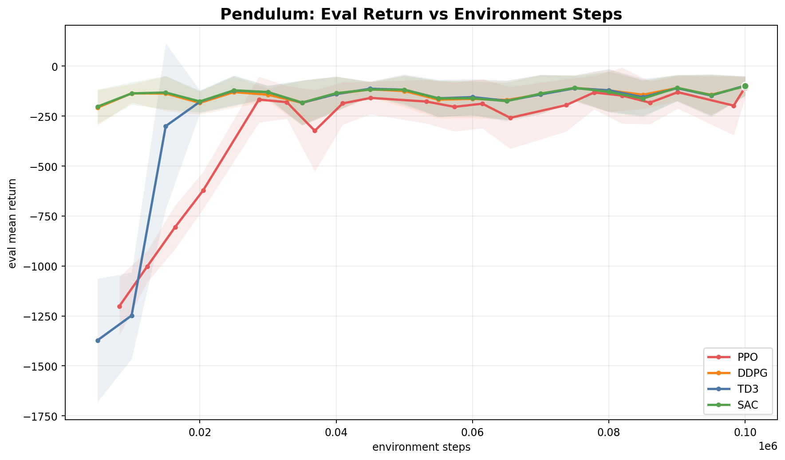
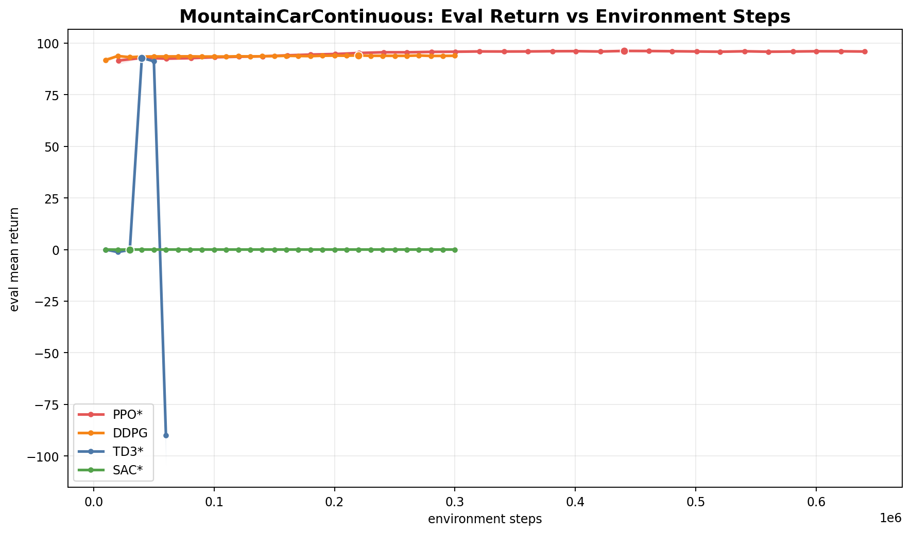
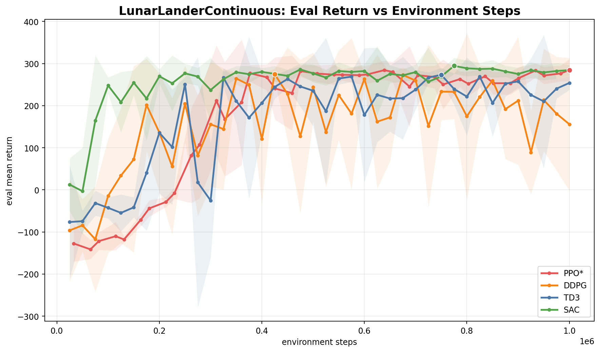
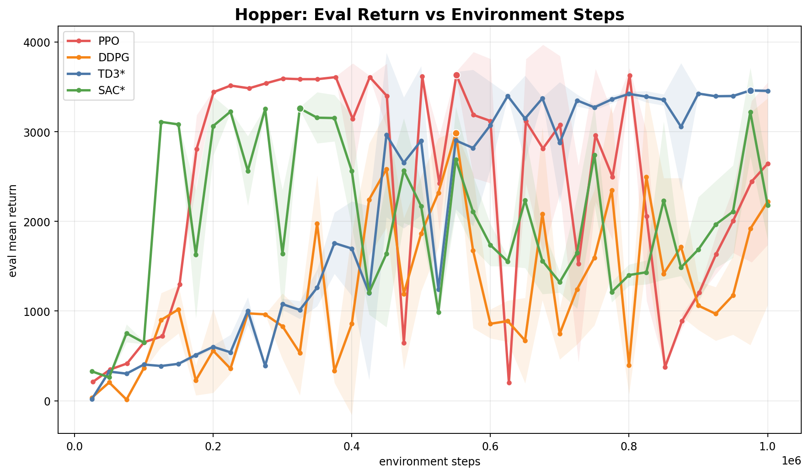
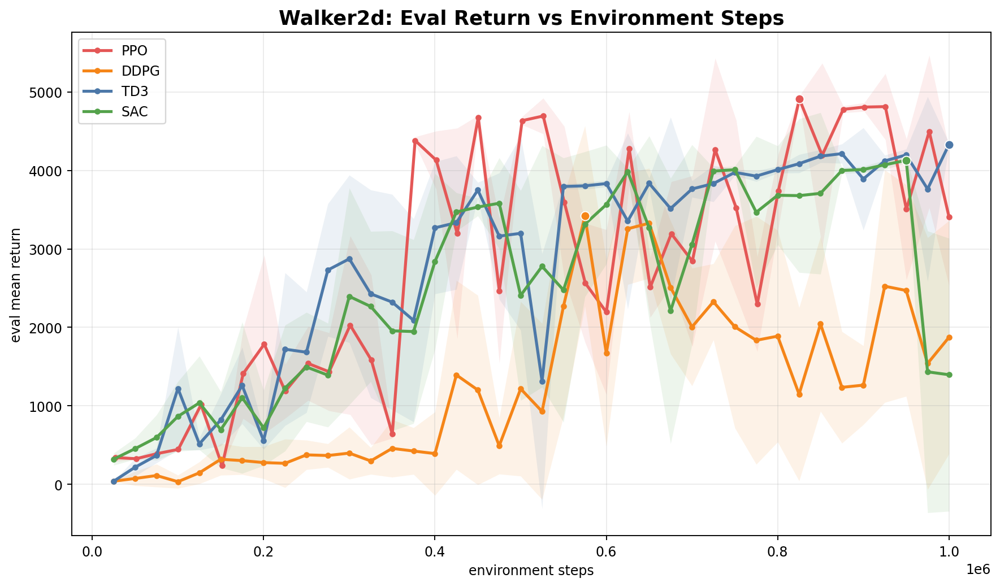
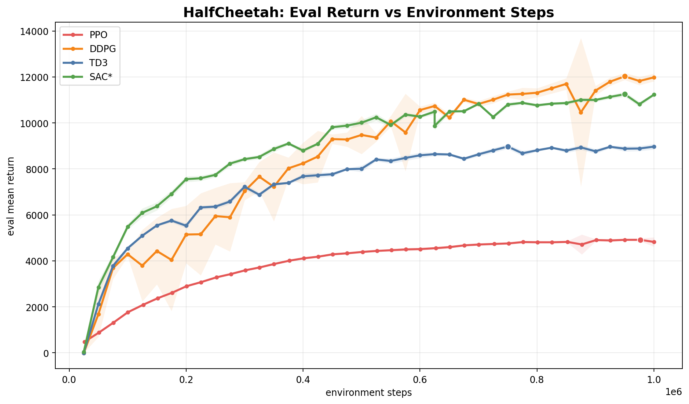
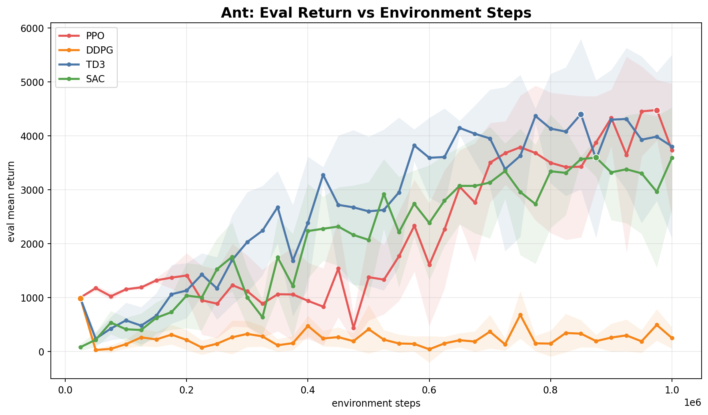

# Continuous Control Algorithm Comparison

Date: 2026-05-28

This report compares PPO, DDPG, TD3, and SAC on continuous-action control
tasks:

- Classic control: `Pendulum-v1`, `MountainCarContinuous-v0`
- Box2D: `LunarLanderContinuous-v3`
- MuJoCo: `Hopper-v5`, `Walker2d-v5`, `HalfCheetah-v5`, `Ant-v5`

The main run root is `runs/continuous_action_compare/fresh_20260519_204517`.
The final table also incorporates later targeted reruns from:

- `runs/continuous_action_compare/sac_half_mse_warmup_20260520_000000`
- `runs/continuous_action_compare/fix_ablation`
- `runs/continuous_action_compare/mountain_car_tuning`

The selection rule for the final table is the highest observed
`best_eval_mean` for each task and algorithm among the original fresh runs plus
the newer targeted runs. This matches the previous table construction, but it
does mean some cells use tuned or fix-ablation runs rather than the original
strict one-seed comparison. The CSVs copied with this note keep the source run
directory, final eval, best eval, and external reference for every selected
cell.

## Summary Table

Each cell shows our best eval mean at the evaluation step, an external reference
value, and the percent gap. `*` means the selected value came from a newer run
rather than the original fresh comparison.

| Task | PPO | DDPG | TD3 | SAC |
|---|---:|---:|---:|---:|
| Pendulum | -105.0 @ 100k ref -172.2 +39.0% | -100.0 @ 100k ref -152.1 +34.2% | -97.46 @ 100k ref -151.9 +35.8% | -100.0 @ 100k ref -157.0 +36.3% |
| MountainCarContinuous | *96.21 @ 440.3k ref 88.34 +8.9% | 94.04 @ 220k ref 93.51 +0.6% | *92.83 @ 40k ref 93.48 -0.7% | *-4.23e-06 @ 30k ref 94.68 -100.0% |
| LunarLanderContinuous | *284.7 @ 1M ref 270.9 +5.1% | 274.9 @ 425k ref 230.2 +19.4% | 273.2 @ 750k ref 207.5 +31.7% | 294.5 @ 775k ref 260.4 +13.1% |
| Hopper | 3632 @ 550.9k ref 2609 +39.2% | 2983 @ 550k ref 2197 +35.8% | *3460 @ 975k ref 3472 -0.4% | *3260 @ 325k ref 3542 -8.0% |
| Walker2d | 4909 @ 825.3k ref 3588 +36.8% | 3419 @ 575k ref 1401 +144.1% | 4332 @ 1M ref 3982 +8.8% | 4129 @ 950k ref 5007 -17.5% |
| HalfCheetah | 4917 @ 976.9k ref 5784 -15.0% | 12026 @ 950k ref 11719 +2.6% | 8975 @ 750k ref 10201 -12.0% | *11249 @ 950k ref 12139 -7.3% |
| Ant | 4475 @ 975.4k ref 3258 +37.3% | 983.0 @ 25k ref 990.4 -0.7% | 4399 @ 850k ref 5116 -14.0% | 3594 @ 875k ref 5850 -38.6% |

## Learning Curves

The plots below use environment steps on the x-axis and evaluation mean return
on the y-axis. A star in the legend marks a selected newer run. Shading is
`+/- eval_std_return` when available.

## Key Observations

The selected results should be read as a diagnostic best-result summary, not as
a final statistically controlled benchmark. The table mixes the original fresh
sweep with later targeted tuning and fix runs, then selects the best checkpoint
seen for each task and algorithm. This is useful for understanding what worked,
but it also means the results reflect unequal follow-up effort.

Peak-return and final-policy conclusions differ materially. PPO often reached
the highest selected checkpoint, especially on Hopper, Walker2d, and Ant, while
TD3 was usually stronger by final eval on those same MuJoCo tasks. For unstable
tasks, the final or last-N eval return is at least as important as the best
checkpoint.

SAC underperformed relative to the usual expectation from the SAC literature,
but the obvious implementation issues were not the explanation. The code has
separate actor, critic, and temperature learning rates; uses the standard-style
`0.5 * MSE` critic loss scaling; and handles time-limit truncation reasonably.
The remaining gap is more likely due to subtler config or implementation-parity
details such as update schedule, entropy-temperature dynamics, target entropy,
replay/warmup behavior, normalization support, or evaluation/checkpointing.

Several small config changes had large effects. LunarLander PPO improved sharply
after advantage normalization, Hopper TD3 became much more stable with the
classic `400,300` network size, and MountainCarContinuous required substantially
different exploration or rollout settings across algorithms.

Hopper and Walker2d exposed stability problems more clearly than raw peak
tables do. Large peak-to-final drops appeared for MountainCar TD3, Hopper PPO,
Hopper SAC, Walker2d SAC, and Ant PPO. These are not just noisy details; they
change which algorithm looks best.

DDPG's HalfCheetah result is strong enough to be treated as a reproduction
target. It produced the best selected HalfCheetah return in this experiment set,
but that outcome is unusual relative to the common TD3/SAC expectation and
should be rerun across multiple seeds before drawing a general conclusion.

The next benchmark should rerun the updated canonical configs fresh for multiple
seeds, use equal per-task budgets, increase final evaluation episodes, and
report both best-checkpoint and final or last-N returns.

## Winners

Using peak eval mean, the selected winners were:

| Task | Best selected algorithm | Best eval |
|---|---|---:|
| Pendulum | TD3 | -97.5 |
| MountainCarContinuous | PPO | 96.2 |
| LunarLanderContinuous | SAC | 294.5 |
| Hopper | PPO | 3631.7 |
| Walker2d | PPO | 4908.9 |
| HalfCheetah | DDPG | 12026.2 |
| Ant | PPO | 4475.4 |

Using final eval mean from the selected run instead of peak eval, the winners
shift:

| Task | Best final algorithm | Final eval |
|---|---|---:|
| Pendulum | TD3 | -97.5 |
| MountainCarContinuous | PPO | 95.9 |
| LunarLanderContinuous | PPO | 284.7 |
| Hopper | TD3 | 3454.8 |
| Walker2d | TD3 | 4331.6 |
| HalfCheetah | DDPG | 11982.1 |
| Ant | TD3 | 3801.1 |

This difference matters. Several algorithms, especially on Hopper and Ant, can
hit a good checkpoint and then degrade. Peak eval is useful for checkpoint
selection, while final eval is more conservative for algorithm comparison.

## Main Findings

PPO was stronger than expected in the selected peak-eval table. It won four of
seven tasks by peak return: MountainCarContinuous, Hopper, Walker2d, and Ant.
However, this should not be interpreted as PPO dominance in a general sense.
The comparison is mostly one seed, and the MountainCar and LunarLander PPO cells
come from targeted tuning or fix runs.

TD3 became much more credible after the Hopper fix. The original Hopper TD3
run peaked at only `1573.5`, but the `400,300` hidden-size fix run reached
`3459.6` and finished at `3454.8`. TD3 also had the best final eval on
Pendulum, Hopper, Walker2d, and Ant among selected runs.

DDPG was surprisingly strong on HalfCheetah and competitive on several tasks.
It solved MountainCarContinuous cleanly, matched or exceeded several external
references, and produced the best HalfCheetah result. It remained weak on Ant
and unstable on Hopper, which is consistent with DDPG's sensitivity to task and
exploration settings.

SAC did not dominate this implementation, despite the expectation from the SAC
paper and common benchmark practice. It was best on LunarLanderContinuous by
peak eval and improved on HalfCheetah after the rerun, but it failed
MountainCarContinuous, underperformed external MuJoCo SAC references, and
showed late degradation on Hopper.

Hopper is the clearest stability warning. Hopper policies often alternate
between full-length episodes and early falls, so returns can swing sharply.
The fixed TD3 run was the only Hopper selected run that stayed consistently
near its best checkpoint. PPO, DDPG, and SAC all showed substantial instability
or high eval variance in at least part of training.

## Task Notes

### Pendulum

All algorithms solved Pendulum to roughly the same range. TD3 had the best
selected return, but the spread between TD3, SAC, DDPG, and PPO is small enough
that one seed is not conclusive.

### MountainCarContinuous

DDPG solved the task in the original fresh comparison. The tuned PPO run later
became the best selected result. TD3 found a good early checkpoint after tuning
but collapsed soon afterward, so its selected value should be read as a best
checkpoint result, not a stable final policy. SAC remained near zero return and
did not solve the task in these runs.

### LunarLanderContinuous

SAC had the best peak eval at `294.5`, while the fixed PPO run had the best
final eval at `284.7`. DDPG and TD3 were also competitive. This task is the
healthiest across algorithms in the current set.

### Hopper

Hopper was unstable across several algorithms. The TD3 fix run is the main
exception: it reached `3459.6` and finished essentially unchanged. PPO reached
a high best checkpoint, but its final eval was far lower and high variance.
SAC reached a good early checkpoint but later regressed. DDPG was also
non-monotonic.

### Walker2d

PPO had the best peak checkpoint, but TD3 had the best final selected result.
SAC reached a competitive peak but finished poorly in the original fresh run.
DDPG improved but remained below PPO, TD3, and SAC by peak return.

### HalfCheetah

DDPG produced the strongest result and exceeded the external reference used in
the table. SAC improved materially after the rerun, moving from about `10143`
to `11249`, but still remained below the external SAC reference. PPO lagged the
off-policy methods on this task.

### Ant

PPO had the best peak selected return, while TD3 had the best final selected
return. SAC remained far below its external reference, and DDPG failed to learn
a strong Ant policy beyond an early low-return plateau.

## Caveats

The comparison is primarily one seed. Rankings should be treated as directional
and diagnostic, not statistically final.

The final selected table mixes the original fresh comparison with targeted
tuning and fix runs. This is useful for summarizing the best result available
from the experiment set, but it is not a strictly controlled hyperparameter
study.

External references are orientation targets, not exact apples-to-apples
baselines. Our MuJoCo runs use Gymnasium/EnvPool `v5` environments, while many
published or library benchmark values use older Gym/MuJoCo task versions,
different seeds, different evaluation episode counts, and different reporting
rules.

Peak eval can overstate unstable runs. For future tables, use both best eval
and final or last-N eval mean. Hopper, MountainCar TD3, and Ant are the clearest
examples where this distinction changes the interpretation.

## Data Files

- Selected table CSV:
  `research_notes/continuous_action_control_comparison_assets/selected_results.csv`
- All parsed eval runs:
  `research_notes/continuous_action_control_comparison_assets/all_eval_runs_summary.csv`
- Original updated table and plot artifacts:
  `runs/continuous_action_compare/updated_table_20260521`

## References

- RL Baselines3 Zoo benchmark/model references:
  https://github.com/DLR-RM/rl-baselines3-zoo
- Tianshou MuJoCo benchmark reference:
  https://tianshou.org/en/v0.4.9/tutorials/benchmark.html
- TD3 paper:
  https://arxiv.org/abs/1802.09477
- SAC Algorithms and Applications:
  https://arxiv.org/abs/1812.05905
- Gymnasium Hopper documentation:
  https://gymnasium.farama.org/environments/mujoco/hopper/
