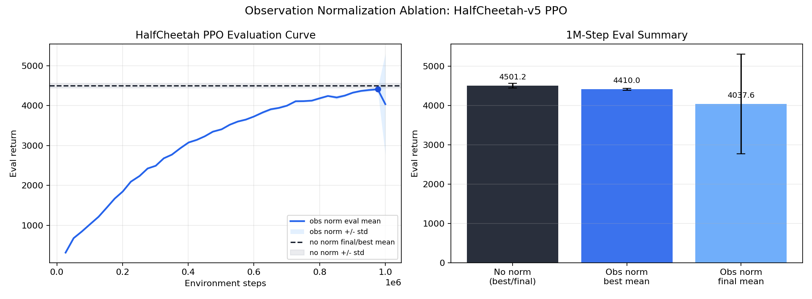

# HalfCheetah PPO Report

Date: 2026-05-14

## Setup

All runs used `src/train_ppo.py`, CPU execution, seed `123`, `HalfCheetah-v5`,
10 evaluation episodes, and config-only changes. The main search compared the
repo default, PPO settings inspired by common HalfCheetah references, a
log-std/parallel-env variant, and rollout-step ablations. It did not use
source-level techniques such as normalization, schedules, or architecture
changes beyond the YAML-exposed MLP size. A follow-up observation-normalization
ablation is reported below.

## Best Config

Saved as `configs/half_cheetah_ppo.yaml`.

| Parameter | Value |
|---|---:|
| num envs | 16 |
| hidden sizes | [256, 256] |
| init log std | -2.0 |
| training steps | 1000000 |
| learning rate | 0.00002 |
| discount factor | 0.98 |
| GAE lambda | 0.92 |
| rollout steps | 128 |
| minibatch size | 64 |
| PPO epochs | 20 |
| clip coef | 0.1 |
| value coef | 0.6 |
| entropy coef | 0.004 |
| max grad norm | 0.8 |

## Result

The current best 1M-step run is
`runs/20260514-135607-383284-half_cheetah_ppo_simplified_1m-seed123`.

| Run | Steps | Best eval return | Final eval return | Wall time |
|---|---:|---:|---:|---:|
| current simplified config | 1M | 4501.2 +/- 57.7 | 4501.2 +/- 57.7 | 11:17.60 |
| previous best rounded-search config | 1M | 4091.0 +/- 45.0 | 4091.0 +/- 45.0 | 11:44 |
| SB3-like no-normalization reference | 1M | 3717.8 +/- 110.4 | 3521.1 +/- 938.6 | 15:07 |
| repo starting config | 1M | 1555.5 +/- 43.2 | 1498.9 +/- 63.6 | 4:20 |

The simplified coefficients improved the best 1M result by about `+410` eval
return over the previous best single-seed run. The higher entropy coefficient
(`0.004`) did not hurt this run, but this is still a single-seed result.

## Observation Normalization Ablation

A follow-up run used the same saved config with
`--set env.observation_normalization={}`. The run directory is
`runs/half_cheetah_ppo_obs_norm_1m_seed123`.

| Run | Steps | Best eval mean | Final eval mean | Best single eval episode | Wall time |
|---|---:|---:|---:|---:|---:|
| no observation normalization | 1M | 4501.2 +/- 57.7 | 4501.2 +/- 57.7 | not recorded | 11:17.60 |
| observation normalization | 1M | 4410.0 +/- 24.8 | 4037.6 +/- 1263.7 | 4514.3 | 12:10.54 |

Observation normalization did not improve this tuned HalfCheetah PPO config. It
nearly matched the no-normalization best mean late in training, but the final
evaluation became highly variable. The best single final episode was competitive
with the no-normalization mean, but the mean result was worse and less stable.
For this config, keep observation normalization disabled by default.

## Rollout Ablation

Using the same best config family, longer 5M runs showed that `rollout_steps=128`
remained strongest. Larger rollouts were smoother but learned more slowly.

| Rollout steps | Best eval return | Final eval return | Wall time |
|---:|---:|---:|---:|
| 128 | 5792.9 +/- 54.8 | 5519.6 +/- 423.4 | 58:58 |
| 256 | 5046.7 +/- 73.3 | 4487.4 +/- 1415.0 | 1:03:21 |
| 512 | 4196.9 +/- 27.7 | 4196.9 +/- 27.7 | 59:17 |

Recommendation: keep `rollout_steps=128` as the default. The 512-step setting
has cleaner-looking eval variance, but it underperforms at both 1M and 5M in
this implementation.

## Plots

### Current Best 1M Run

### 1M Rollout Ablation

### 5M Rollout Ablation

### Observation Normalization Ablation

