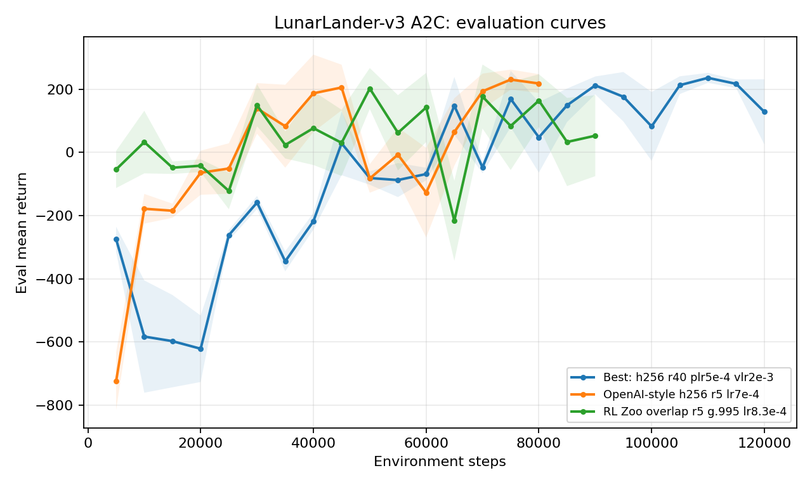
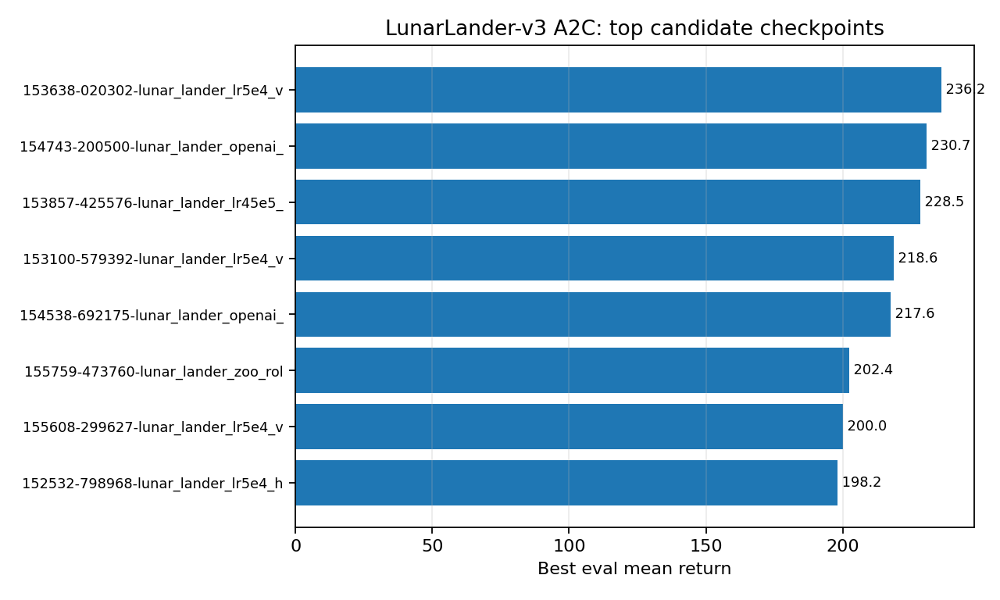

# LunarLander A2C Report

Date: 2026-05-10

## Setup

All runs used `src/train_a2c.py`, CPU execution, and config-only changes. The search covered the initial CartPole-transfer A2C settings, local rollout and learning-rate variants, OpenAI Baselines overlap settings, and RL Baselines3 Zoo-inspired overlap settings. Source-level features from those external configs such as vectorized environments, RMSProp, entropy regularization, value-loss weighting, tanh activations, and learning-rate schedules are not exposed by this repo's YAML config.

## Best Config

Saved as `configs/lunar_lander_a2c.yaml`.

| Parameter | Value |
|---|---:|
| hidden sizes | [256, 256] |
| training steps | 120000 |
| policy learning rate | 0.0005 |
| value learning rate | 0.002 |
| discount factor | 0.99 |
| rollout steps | 40 |
| max grad norm | 0.5 |
| seed | 123 |

## Result

Best checkpoint: step `110000`, eval mean return `236.16`, eval std `15.77`, best eval episode `267.80`.

The best single eval episode in the wider sweep was `308.22`, but the strongest averaged result was the saved `[256, 256]`, rollout-40 configuration. OpenAI Baselines / RL Zoo overlap variants were useful context, but they did not beat this lower-actor, higher-critic learning-rate family.

## Plots

