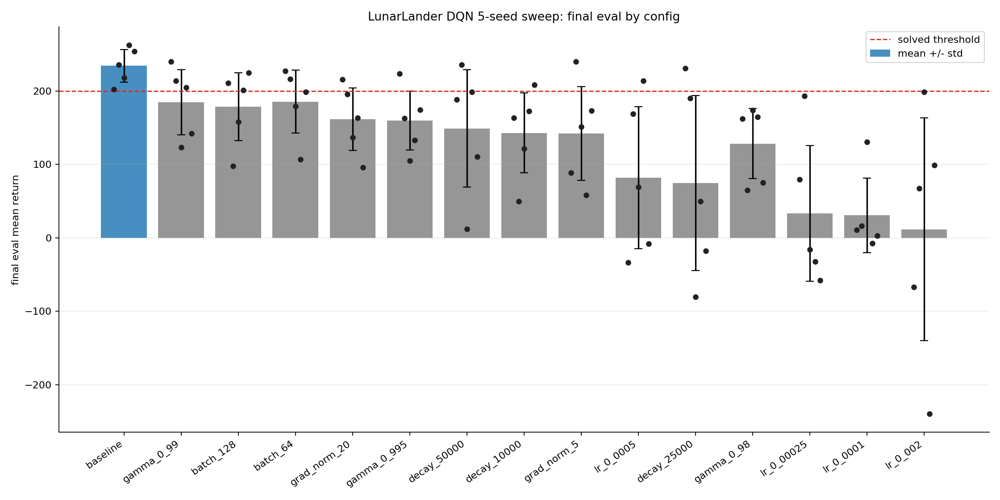
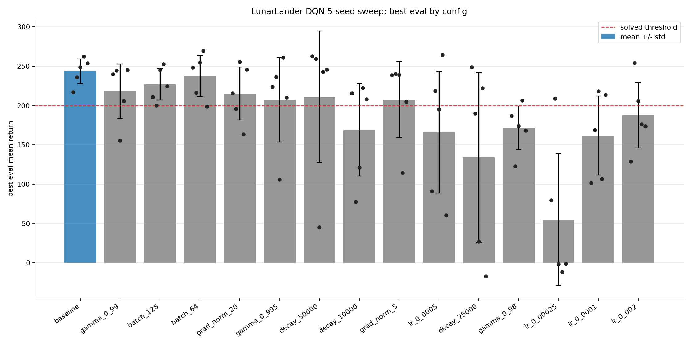

# LunarLander DQN Report

Date: 2026-05-07

Run root: `runs/sweep-20260507-172625-tau001-eps010-5seeds`

## Setup

This experiment reran the LunarLander DQN hyperparameter screen with five
training seeds per config. All runs used CPU, `100000` environment steps,
evaluation every `5000` steps, and 10 evaluation episodes per checkpoint.

Seeds: `123`, `456`, `789`, `101112`, `131415`

Baseline config:

| Parameter | Value |
|---|---:|
| hidden sizes | [128, 128] |
| batch size | 32 |
| replay buffer capacity | 50000 |
| learning rate | 0.001 |
| discount factor | 1.0 |
| soft update rate | 0.001 |
| max grad norm | 10 |
| epsilon schedule | linear |
| epsilon start / end | 1.0 / 0.10 |
| epsilon decay steps | 2500 |
| learning starts | 1000 |

The Gymnasium LunarLander-v3 documentation considers an episode solved at
`>= 200` points. The older benchmark convention uses an average score of 200
over 100 consecutive trials, so this 10-episode checkpoint evaluation is a
screening result rather than a formal benchmark certificate.

## Core Results

All 75 runs completed successfully.

| Config | Avg final eval | Final std | Final solved | Avg best eval | Best solved |
|---|---:|---:|---:|---:|---:|
| baseline | 234.50 | 22.22 | 5/5 | 243.60 | 5/5 |
| gamma_0_99 | 184.80 | 44.50 | 3/5 | 218.26 | 4/5 |
| batch_128 | 178.50 | 46.07 | 3/5 | 226.78 | 5/5 |
| batch_64 | 185.57 | 42.71 | 2/5 | 237.62 | 4/5 |
| grad_norm_20 | 161.45 | 42.54 | 1/5 | 215.22 | 3/5 |
| gamma_0_995 | 159.90 | 40.05 | 1/5 | 207.30 | 4/5 |

The baseline was the only configuration that solved all five seeds at final
evaluation. Several alternatives had high peak scores, but they were less
stable across seeds and often regressed by the final checkpoint.

## Recommendation

Keep the LunarLander DQN default at:

```yaml
train:
  soft_update_rate: 0.001
exploration:
  end: 0.10
```

Do not update `batch_size`, `discount_factor`, `exploration.decay_steps`, or
`max_grad_norm` from this sweep. If the next goal is a stronger benchmark
claim, run a final 100-episode evaluation over the same five seeds and consider
adding checkpoint-on-best-eval before more hyperparameter search.

## Plots

### Final Eval Summary



### Best Eval Summary


