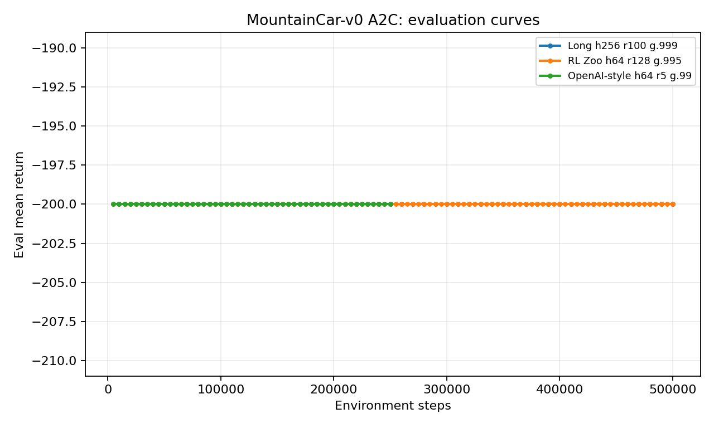
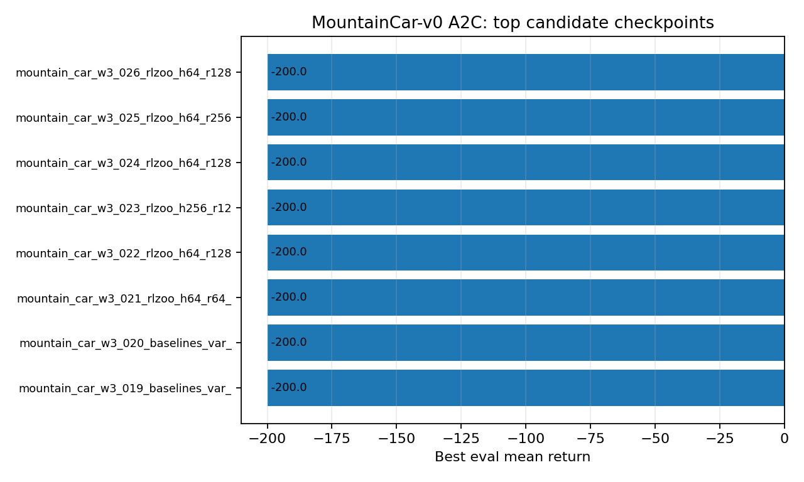

# MountainCar A2C Report

Date: 2026-05-10

## Setup

All runs used `src/train_a2c.py`, CPU execution, and config-only changes. The search covered short OpenAI Baselines overlap settings, longer sparse-reward rollouts, seed checks, and RL Baselines3 Zoo-inspired rollout and gamma ranges. Source-level features used by common reference configs, especially vectorized environments and observation normalization, are not exposed by this repo's YAML config.

## Best Config

Saved as `configs/mountain_car_a2c.yaml`.

| Parameter | Value |
|---|---:|
| hidden sizes | [256] |
| training steps | 500000 |
| policy learning rate | 0.0003 |
| value learning rate | 0.0001 |
| discount factor | 0.999 |
| rollout steps | 100 |
| max grad norm | null |
| seed | 456 |

## Result

No A2C configuration escaped the timeout floor. The best eval mean return was `-200.0`, and every tested candidate tied at that value.

The saved config is the most defensible long-run candidate from the search, not a solved setting. The repeated flat result suggests the current implementation is missing important ingredients used by standard A2C references for this task, especially observation normalization and vectorized rollouts.

## Plots

