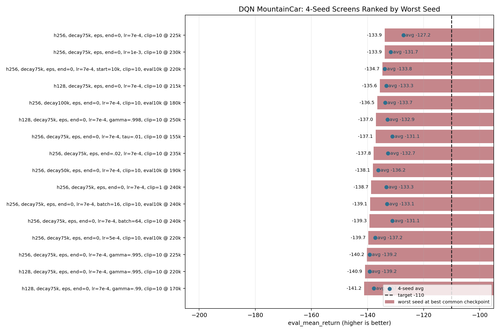
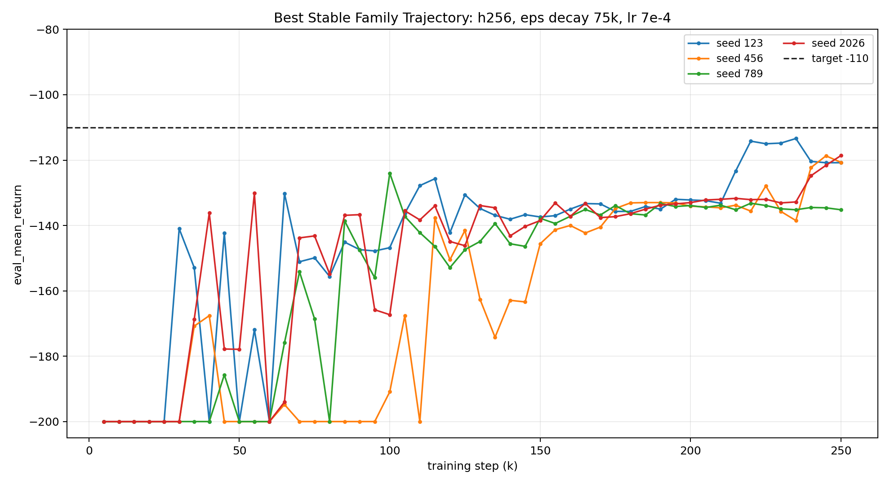
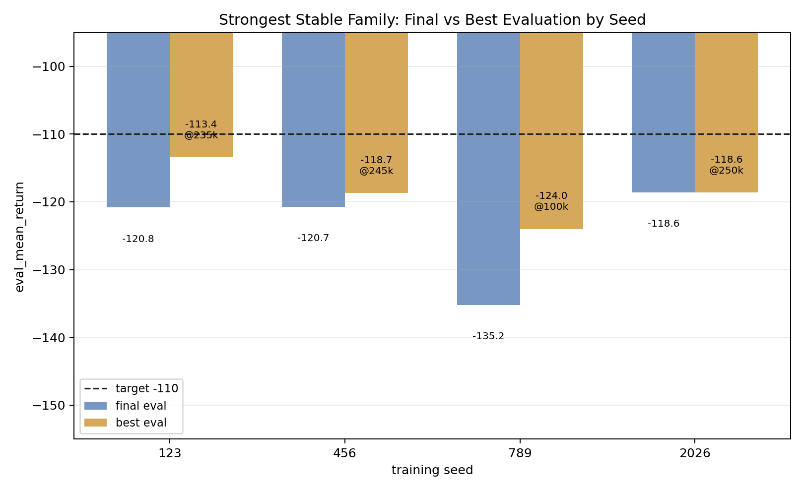
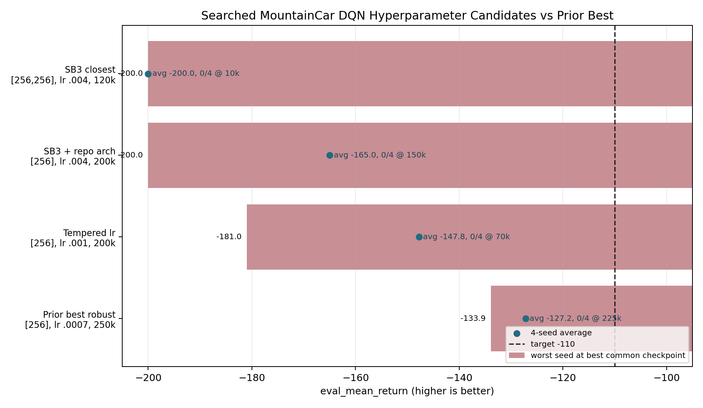

# MountainCar DQN Report

Date: 2026-05-10

## Setup

This experiment searched for a stronger DQN configuration for `MountainCar-v0`
using CPU runs from `src/train_dqn.py`. The search initially used CLI
overrides only. The best robust setting found so far has now been saved into
`configs/mountain_car_dqn.yaml`.

Saved config:

| Parameter | Value |
|---|---:|
| hidden sizes | [256] |
| training steps | 250000 |
| batch size | 32 |
| replay buffer capacity | 50000 |
| learning starts | 1000 |
| learning rate | 0.0007 |
| discount factor | 1.0 |
| soft update rate | 0.005 |
| max grad norm | 10 |
| epsilon schedule | linear |
| epsilon start / end | 1.0 / 0.0 |
| epsilon decay steps | 75000 |

## Core Results

The saved config is the best robust candidate found in the search, but it does
not meet the stricter final stop criterion of 10/10 seeds reaching final
`eval_mean_return >= -110`.

Best common 4-seed checkpoint for the saved config:

| Seed | eval_mean_return at step 225000 |
|---:|---:|
| 123 | -115.0 |
| 456 | -127.9 |
| 789 | -133.9 |
| 2026 | -132.0 |
| Average | -127.2 |
| Worst seed | -133.9 |

Final-step results at 250000 steps:

| Seed | Final eval mean | Best eval mean |
|---:|---:|---:|
| 123 | -120.8 | -113.4 |
| 456 | -120.7 | -118.7 |
| 789 | -135.2 | -124.0 |
| 2026 | -118.6 | -118.6 |

## Follow-Up Checks

Published SB3 / RL Baselines3 Zoo style settings were also tested with the
closest hyperparameters available in this repo, while keeping soft target
updates. They did not improve over the saved config.

| Candidate | Best common checkpoint | Result |
|---|---:|---|
| SB3 closest compatible, `[256, 256]`, lr `0.004` | avg `-200.0`, worst `-200.0` | 0/4 seeds solved |
| SB3 values with repo-favored `[256]`, lr `0.004` | avg `-165.0`, worst `-200.0` | 0/4 seeds solved |
| Tempered SB3-style lr `0.001` | avg `-147.8`, worst `-181.0` | 0/4 seeds solved |
| Saved config, lr `0.0007` | avg `-127.2`, worst `-133.9` | 0/4 seeds solved |

Soft update rate `0.003` was also tested on the saved config family and was
worse than the default `0.005`: avg `-140.4`, worst `-141.3` at its best common
4-seed checkpoint.

## Conclusion

The saved MountainCar DQN config is the strongest robust candidate found so far
within the current implementation and CLI-accessible hyperparameters. It is a
clear improvement over the original baseline, which stayed at `-200.0`, but it
should not be treated as a solved MountainCar setting because it did not pass
multi-seed validation.

## Plots

