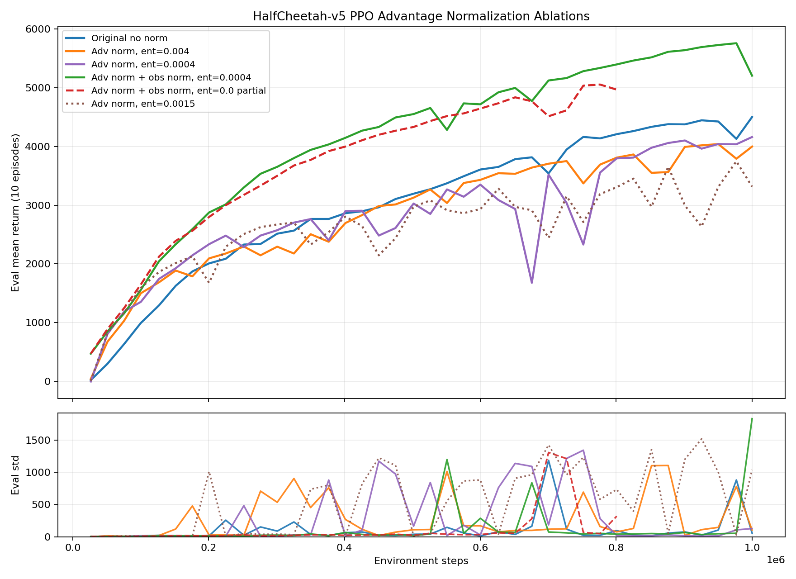
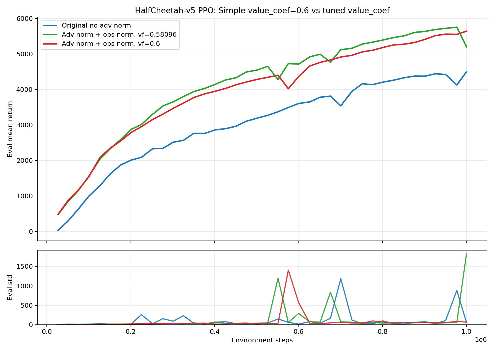
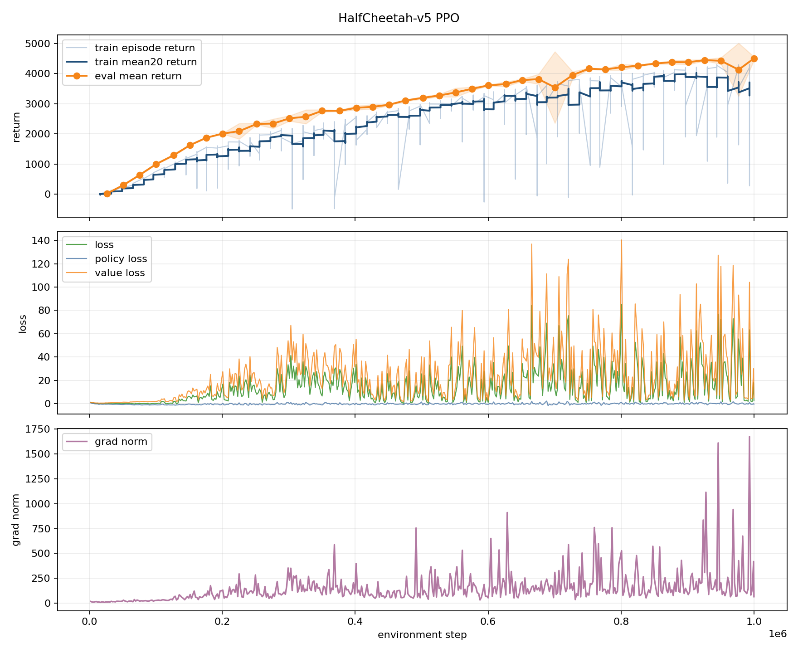
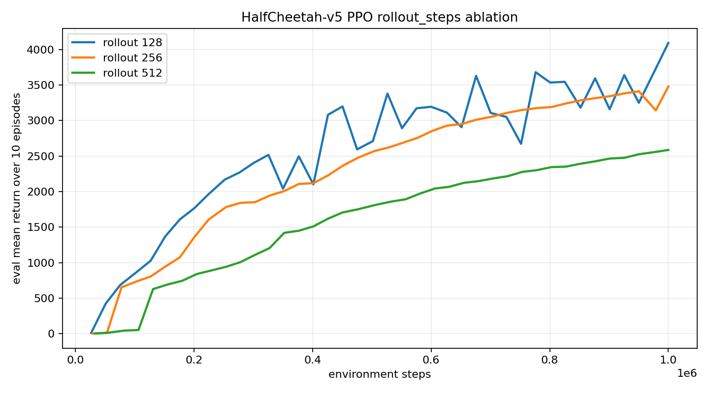
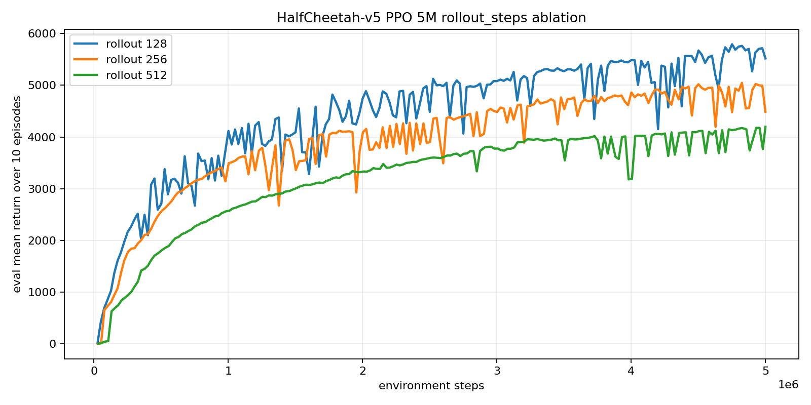

# PPO MuJoCo Report

Date: 2026-05-14; updated 2026-05-17

## Setup

All runs used `src/train_ppo.py`, CPU execution, seed `123`, 10 evaluation
episodes, and config-only changes. The main HalfCheetah search compared the repo
default, PPO settings inspired by common HalfCheetah references, a
log-std/parallel-env variant, and rollout-step ablations. The first pass did not
use normalization. The follow-up study added configurable advantage
normalization and enabled observation normalization through the existing
environment wrapper path.

The later MuJoCo extension applied the same implementation to `Hopper-v5`,
`Walker2d-v5`, and `Ant-v5`. PPO runs were kept sequential and low priority
while another training job was active. The web baselines used for orientation
were [CleanRL's continuous-control PPO defaults](https://docs.cleanrl.dev/rl-algorithms/ppo/)
and [RL Baselines3 Zoo's tuned MuJoCo PPO hyperparameters](https://raw.githubusercontent.com/DLR-RM/rl-baselines3-zoo/master/hyperparams/ppo.yml).

## Best Config

Saved as `configs/half_cheetah_ppo.yaml`.

| Parameter | Value |
|---|---:|
| num envs | 16 |
| observation normalization | enabled, clip=10, epsilon=1e-8 |
| hidden sizes | [256, 256] |
| init log std | -2.0 |
| training steps | 1000000 |
| learning rate | 0.00002 |
| discount factor | 0.98 |
| GAE lambda | 0.92 |
| rollout steps | 128 |
| minibatch size | 64 |
| PPO epochs | 20 |
| clip coef | 0.1 |
| value coef | 0.6 |
| entropy coef | 0.0004 |
| max grad norm | 0.8 |
| normalize advantages | true |

## Result

The current best 1M-step default run is
`runs/half_cheetah_ppo_advnorm_obsnorm_entropy0004_value06_1m_seed123`.

| Run | Steps | Best eval return | Final eval return |
|---|---:|---:|---:|
| adv norm + obs norm, entropy=0.0004, value=0.6 | 1M | 5645.4 +/- 63.6 | 5645.4 +/- 63.6 |
| adv norm + obs norm, entropy=0.0004, value=0.58096 | 1M | 5757.1 +/- 54.9 | 5204.2 +/- 1830.8 |
| adv norm + obs norm, entropy=0.0, value=0.58096 | 801k | 5053.6 +/- 49.2 | 4966.7 +/- 320.1 |
| no adv norm, no obs norm, entropy=0.004, value=0.6 | 1M | 4501.2 +/- 57.7 | 4501.2 +/- 57.7 |
| adv norm only, entropy=0.0004 | 1M | 4160.4 +/- 128.0 | 4160.4 +/- 128.0 |
| adv norm only, entropy=0.004 | 1M | 4040.5 +/- 146.5 | 3997.6 +/- 105.0 |
| adv norm only, entropy=0.0015 | 1M | 3747.0 +/- 29.4 | 3314.6 +/- 1037.6 |

The simplified advantage-normalized default improved the final 1M return by
about `+1144` over the previous no-normalization baseline in this single-seed
comparison. The exact `value_coef=0.58096` run reached the highest intermediate
evaluation, but its final evaluation had very high variance. Rounding the value
coefficient to `0.6` gave a slightly lower peak and a much cleaner final result,
so it is the better default.

## Advantage Normalization Study

Advantage normalization alone was not enough. With the old unnormalized
observation stream, turning on `train.normalize_advantages` made the actor update
scale consistent, but the critic still saw large and spiky targets. The raw
advantage standard deviation and scaled value loss stayed volatile late in
training, and the advantage-normalized runs underperformed the old baseline.

Lowering entropy pressure helped because normalized advantages make the policy
loss live on a smaller, more stable scale. Keeping `entropy_coef=0.004` made the
entropy term relatively too influential, while `0.0004` reduced that pressure
without fully removing exploration. A zero-entropy partial run learned well but
trailed the `0.0004` setting, so the default keeps a small entropy bonus.

Observation normalization was the decisive change. Once observations were
normalized, the critic targets and raw advantages became less erratic, and the
advantage-normalized actor update could outperform the original no-normalization
config. The main practical takeaway is that advantage normalization should be
tuned with the value and observation scale, not treated as an isolated switch.

## Essential PPO Metric

The temporary advantage diagnostics were useful during the ablation, but they are
too noisy for steady-state training logs. Keep only the standard PPO policy-move
diagnostic added during this work:

| Metric | Keep because |
|---|---|
| `approx_kl` | Tracks policy-update size directly and catches overly aggressive normalized updates. |

The debug-only advantage fields can be removed from normal metrics: raw
advantage mean, abs mean, min, max, effective advantage mean, effective advantage
standard deviation, effective advantage abs mean, scaled value loss, and entropy
loss magnitude. Under `normalize_advantages=true`, the effective advantage mean
and standard deviation are mostly expected by construction, so they are good
implementation checks but poor long-term training signals.

## Rollout Ablation

Using the same best config family, longer 5M runs showed that `rollout_steps=128`
remained strongest. Larger rollouts were smoother but learned more slowly.

| Rollout steps | Best eval return | Final eval return | Wall time |
|---:|---:|---:|---:|
| 128 | 5792.9 +/- 54.8 | 5519.6 +/- 423.4 | 58:58 |
| 256 | 5046.7 +/- 73.3 | 4487.4 +/- 1415.0 | 1:03:21 |
| 512 | 4196.9 +/- 27.7 | 4196.9 +/- 27.7 | 59:17 |

Recommendation: keep `rollout_steps=128` as the default. The 512-step setting
has cleaner-looking eval variance, but it underperforms at both 1M and 5M in
this implementation.

## MuJoCo Extension: Hopper, Walker2d, Ant

The follow-up goal was to tune PPO for the remaining standard MuJoCo locomotion
tasks without adding new algorithm knobs. Only existing config fields were
changed. All selected configs keep observation normalization and
`normalize_advantages=true`.

### Summary Results

| Task | Selected run | Steps | Best eval mean | Final eval mean |
|---|---|---:|---:|---:|
| Hopper-v5 | `runs/hopper_ppo_cleanrl_lr2e4_seed123_300k` | 300k | 3583.8 +/- 17.6 | 3583.8 +/- 17.6 |
| Walker2d-v5 | `runs/walker2d_ppo_cleanrl_lr2e4_seed123_500k` | 500k | 4402.1 +/- 26.9 | 4257.0 +/- 640.6 |
| Ant-v5 | `runs/ant_ppo_rlzoo_seed123_500k` | 500k | 2383.5 +/- 693.8 | 1709.3 +/- 706.9 |

These single-seed results reached the intended strong-baseline range for all
three tasks. Hopper and Walker2d exceeded the rough CleanRL/SB3-style targets by
a wide margin. Ant cleared the target but remained high-variance, which is
consistent with Ant being more sensitive to policy update scale and exploration
scale in this implementation.

### Selected Configs

| Parameter | Hopper-v5 | Walker2d-v5 | Ant-v5 |
|---|---:|---:|---:|
| num envs | 1 | 1 | 1 |
| init log std | 0.0 | 0.0 | -2.0 |
| learning rate | 0.0002 | 0.0002 | 0.0000190609 |
| discount factor | 0.99 | 0.99 | 0.98 |
| GAE lambda | 0.95 | 0.95 | 0.8 |
| rollout steps | 2048 | 2048 | 512 |
| minibatch size | 64 | 64 | 32 |
| epochs | 10 | 10 | 10 |
| clip coef | 0.2 | 0.2 | 0.1 |
| value coef | 0.5 | 0.5 | 0.677239 |
| entropy coef | 0.0 | 0.0 | 0.00000049646 |
| max grad norm | 0.5 | 0.5 | 0.6 |

The resulting default task configs are saved as `configs/hopper_ppo.yaml`,
`configs/walker2d_ppo.yaml`, and `configs/ant_ppo.yaml`.

### Hopper Findings

The RL Zoo-style Hopper configuration was unstable in this implementation. It
briefly reached about 995 eval return at 50k, then collapsed to about 11 by 75k
after a large policy update. HalfCheetah-transfer settings were stable but too
slow, reaching only about 344 at 200k. Adding the long Hopper horizon
(`gamma=0.999`, `gae_lambda=0.99`) solved survival but repeatedly converged to a
near-1000 return standing/survival policy rather than strong forward locomotion.

The breakthrough was the CleanRL-style exploration scale: `init_log_std=0.0`,
one environment, `rollout_steps=2048`, `clip_coef=0.2`, `value_coef=0.5`, and no
entropy bonus. With `learning_rate=0.0003`, Hopper reached strong returns
quickly but drifted later. Reducing the fixed learning rate to `0.0002` preserved
the strong policy and finished at `3583.8 +/- 17.6` at 300k.

### Walker2d Findings

Walker2d transferred cleanly from the Hopper winner. The same CleanRL-style
config was slow early, staying below 500 until about 150k, then entered the
baseline range after 300k. It reached `4402.1 +/- 26.9` at 450k and finished at
`4257.0 +/- 640.6` at 500k. The high final standard deviation came from some
evaluation episodes still failing early, but the best episodes were consistently
near 4.5k.

### Ant Findings

Ant behaved differently from Hopper and Walker2d. The CleanRL-style config with
`init_log_std=0.0` and `learning_rate=0.0002` collapsed toward near-zero return
by 100k, so it was stopped early. The Ant-specific RL Zoo-style config worked
immediately: lower initial exploration (`init_log_std=-2.0`), much lower
learning rate, shorter GAE horizon, and tighter clipping. It reached
`1720.9 +/- 32.9` by 125k and peaked at `2383.5 +/- 693.8` around 400k.

The final Ant policy was still noisy. Evaluation means stayed mostly in the
1.3k-2.4k range after 100k, and final eval was `1709.3 +/- 706.9`. That is good
enough for the current target, but Ant is the task most likely to benefit from a
future stability sweep, probably around learning rate, clip coefficient, and
evaluation over more seeds.

### Cross-Task Takeaways

There is no single best MuJoCo PPO config for this implementation. HalfCheetah
benefited from many parallel envs, short rollouts, low initial std, low learning
rate, observation normalization, advantage normalization, and a small entropy
bonus. Hopper and Walker2d instead needed much larger initial action noise and
longer single-env rollouts. Ant needed the opposite: small initial std and a very
small learning rate.

The practical split is:

| Task family | Best observed pattern |
|---|---|
| HalfCheetah | parallel envs, short rollout, low std, small entropy bonus |
| Hopper / Walker2d | single env, 2048 rollout, `init_log_std=0`, no entropy bonus |
| Ant | single env, 512 rollout, `init_log_std=-2`, very low learning rate |

Advantage normalization stayed useful across the successful runs, but only when
the rest of the update scale matched the task. The earlier HalfCheetah result
still holds: advantage normalization should be tuned together with observation
scale, value-loss scale, entropy pressure, and KL/update size. The new MuJoCo
runs add one more lesson: initial policy standard deviation can dominate the
search outcome. Too little exploration trapped Hopper in survival-only behavior;
too much exploration broke Ant.

## Plots

### Advantage-Normalization Config Search

### Value Coefficient 0.6 Check

### Previous No-Normalization 1M Run

### 1M Rollout Ablation

### 5M Rollout Ablation

